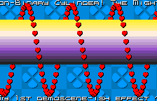
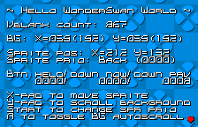

# WonderSwan Homebrew Demo: Hello WonderSwan World

Also known as  "The Mighty Non-Binary Cylinder!", a simple homebrew tech demo for the WonderSwan Color, written in C using the [Wonderful Toolchain](https://wonderful.asie.pl/).

## Screenshots

 
